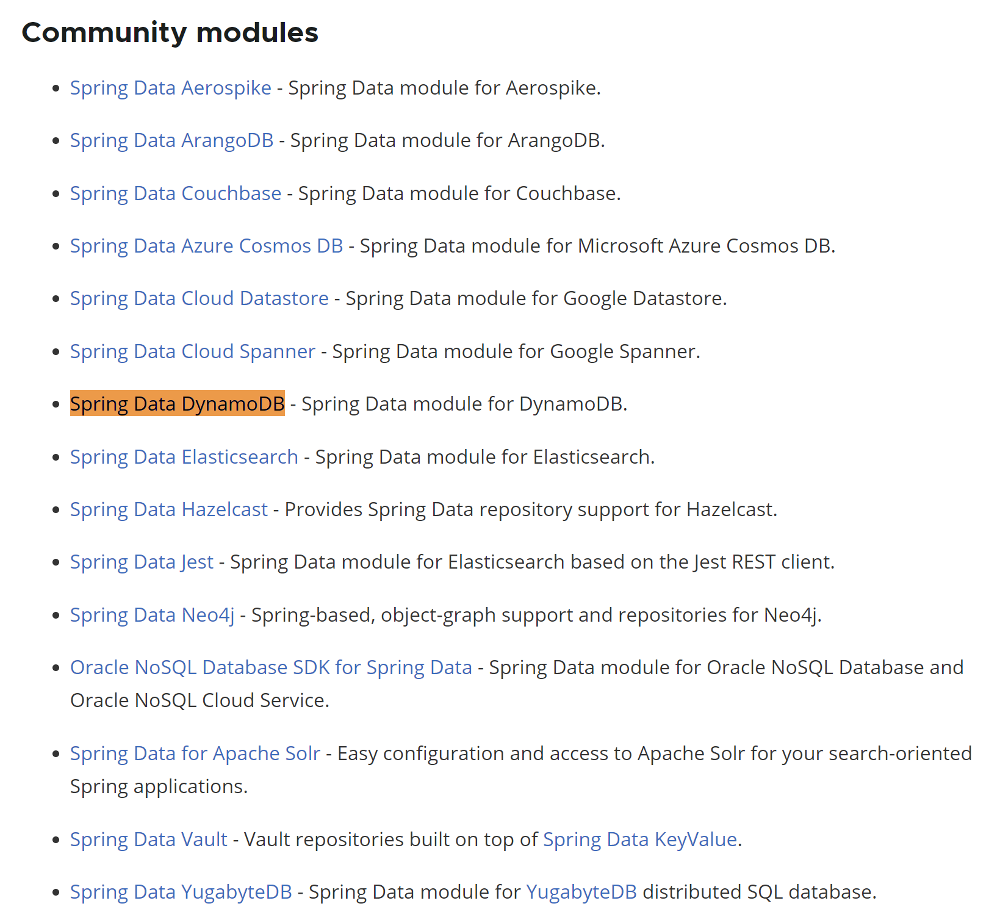
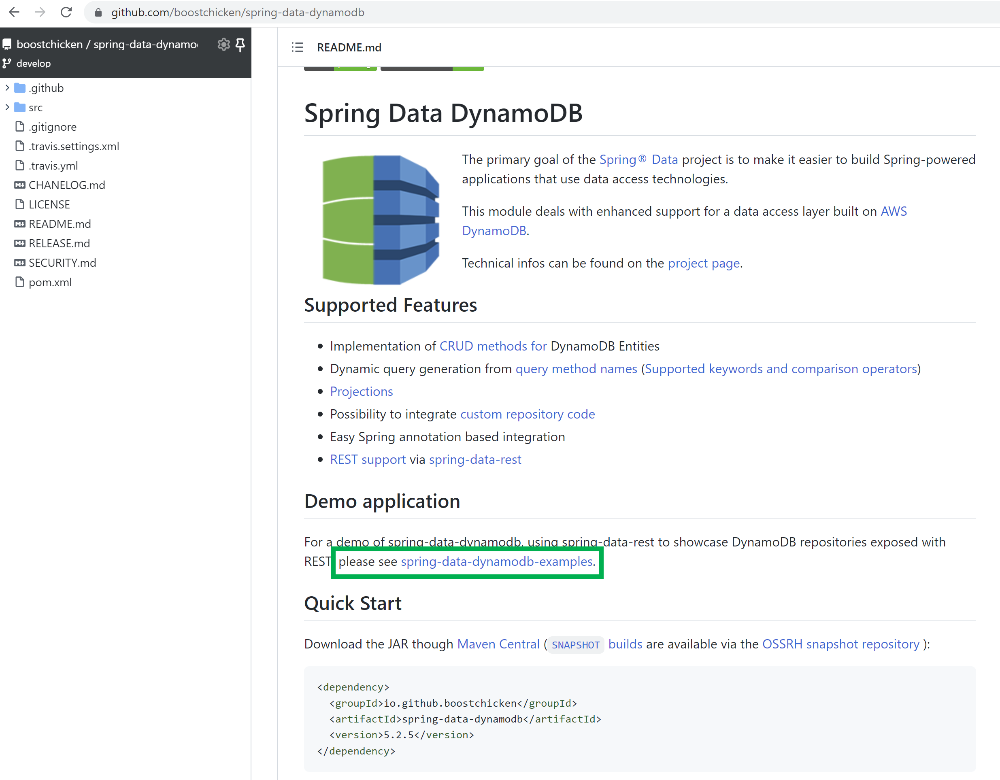

# DynamoDB 참고자료들

어떤 순으로 정리할까 했는데, 처음에 `DynamoDB` 가 뭔지에 대해 아무것도 모르는 상태로 어떤 자료를 먼저 봤는지를 떠올려서 그 순서로 정리하기로 했다. 그게 더 직관적이겠군.. 

 

## Amazon DynamoDB 공식 자료

- [Amazon DynamoDB Documentation 메인 페이지](https://docs.aws.amazon.com/dynamodb/index.html)
  - Developer Guide, API Reference 페이지 네비게이션 페이지
- [Developer Guide](https://docs.aws.amazon.com/amazondynamodb/latest/developerguide/Introduction.html) 
- [API PAGE](https://docs.aws.amazon.com/amazondynamodb/latest/APIReference/Welcome.html)

 

세팅 및 개발 하면서 실제로 참고했던 자료들 (퀵 내비) 

- docker 환경설정 관련 내용들
  - [Setting Up DynamoDB (Web Service)](https://docs.aws.amazon.com/amazondynamodb/latest/developerguide/SettingUp.DynamoWebService.html)
  - [Setting Up DynamoDB Local (Downloadable Version)](https://docs.aws.amazon.com/amazondynamodb/latest/developerguide/DynamoDBLocal.html)
  - [Deploying DynamoDB Locally on Your Computer - Amazon DynamoDB](https://docs.aws.amazon.com/amazondynamodb/latest/developerguide/DynamoDBLocal.DownloadingAndRunning.html)

- [DynamoDB 의 `Table`, `Item`, `Attribute` ](https://docs.aws.amazon.com/amazondynamodb/latest/developerguide/HowItWorks.CoreComponents.html)
  - 세컨더리 인덱스, DynamoDB Streams 까지 읽어봐야 하는데, 아직 모두 읽어보지는 못했다.
- [Use Global Secondary Indexes in DynamoDB](https://docs.aws.amazon.com/amazondynamodb/latest/developerguide/GSI.html)

- [DynamoDB Annotation들](https://docs.aws.amazon.com/ko_kr/amazondynamodb/latest/developerguide/DynamoDBMapper.Annotations.html) 

 

## Dynabase

dynamodb 를 매우 자주 사용한다면, 한번 구매를 고려해봐도 좋겠군 하고 생각만 해봤다. 

[Dynobase - Professional DynamoDB GUI Client](https://dynobase.dev/#pricing) 

 

## 로컬 Docker 기반 환경 세팅시 참고한 자료들

[Dynamo Local from Node-aws: all operations fail "Cannot do operations on a non-existent table"](https://stackoverflow.com/questions/29558948/dynamo-local-from-node-aws-all-operations-fail-cannot-do-operations-on-a-non-e/29560004#29560004)

 

## Spring Data Dynamodb Embedded 환경 세팅

[[DynamoDB] Spring Data DynamoDB와 Embedded 개발 환경 구축하기](https://github.com/jojoldu/blog-code/tree/master/spring-boot-dynamodb) 

 

## 공식 자료

- [Spring Data JPA Ref Documentation](https://docs.spring.io/spring-data/jpa/docs/current/reference/html/)

## 공식 자료는 아니지만, 제일 처음 접할때 도움받은 자료들

> 사이드프로젝트를 급하게 만들어야 하는데, 공부할 시간이 부족해서 바로 적용할 수 있는 자료들을 찾아보다가 읽어봤던 자료들 

 

해외자료

- [DynamoDB and Spring Data. Mapping entities with hash and range… | by Leonardo Carvalho | Medium](https://medium.com/@leohoc/dynamodb-and-spring-data-a81c546a1305)
  - 나한테는 이게 제일 도움이 되었었다.

- [Querying DynamoDB by Date Range](https://medium.com/cloud-native-the-gathering/querying-dynamodb-by-date-range-899b751a6ef2)

- [DynamoDB in a SpringBoot Application Using Spring Data](https://www.baeldung.com/spring-data-dynamodb)
  - 다소 옛날 방식의 예제.
  - 그래도 전체 과정을 훑어볼수 있기에 한번 읽어봤다.
- [Spring Boot CRUD Example using AWS DynamoDB]([Spring Boot CRUD Example using AWS DynamoDB - YouTube](https://www.youtube.com/watch?v=3ay92ZdCgwQ))

 

한국자료들

- [다이나모디비 특징](https://m.blog.naver.com/hys1753/221795921828)
- [다이나모디비의 파티션키와 정렬키](https://pearlluck.tistory.com/528)

- [AWS Dynamodb 와 Spring을 이용한 CRUD API](https://eun-dolphin.tistory.com/25)
- [우아한형제들 | Spring Boot 에서 Repository 로 DynamoDB 조작하기 (1) - 설정부터 실행까지](https://techblog.woowahan.com/2633/)

 

## 참고) 커뮤니티버전의 spring data 모듈들

스프링부트 공식 페이지의 [spring-data 페이지](https://spring.io/projects/spring-data)에 접속해서 아래로 쭈욱 페이지를 내려보다 보면, 아래 캡처와 같은 화면을 접하게 된다. Spring Data DynamoDb는 현재 커뮤니티 버전이다. (사실은 `Ctrl + F` 로 `spring data dynamodb` 를 검색해봤다.) 

 

접속해보면 [https://github.com/boostchicken/spring-data-dynamodb](https://github.com/boostchicken/spring-data-dynamodb) 가 나타난다. 

Demo application 에서 소개하는 링크를 타고 넘어가보자.

Demo application 링크에서 소개하는 링크는 [https://github.com/derjust/spring-data-dynamodb-examples](https://github.com/derjust/spring-data-dynamodb-examples) 이다. 어디서 많이 본 깃헙이다. `mvnrepository` 에서 `spring-data-dynamodb` 를 검색할 때 `boostchicken`, `derjust` 두 가지의 의존성중 어떤 것을 사용할지 고민하는데, 이 중에 보통은 대부분 `boostchicken` 을 많이 사용하지 않나 싶다. (가장 최신 버전이어서.) 그런데 실제로 서로 다른 프로젝트로 운영중이구나 싶다. 언젠가는 통합되겠지 싶다. 

 

